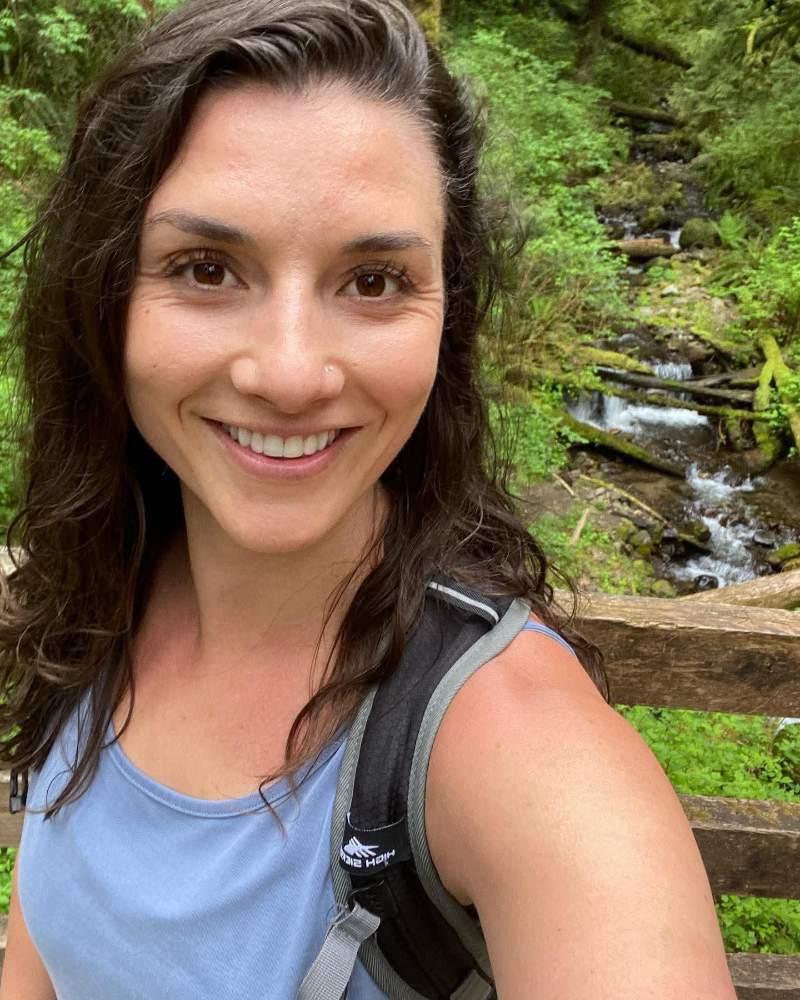
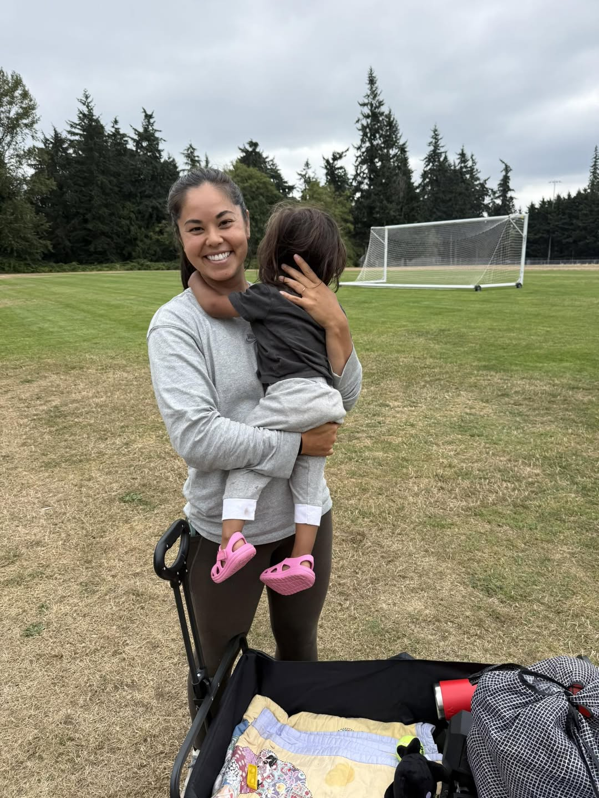

# About the Coaches

## Brittany

Hi! I’m Brittany, proud mama of my two girls Amaiya and Tamia, and wife to my husband Drew. I'm from Humboldt County CA and have been in Seattle since 2010. I’ve been in the fitness industry for 17+ years, mostly in group coaching and management with my time in Seattle at Orangetheory Fitness and Experience Momentum.

All Seasons Fitness was born when my eldest daughter arrived and I realized how few opportunities there were for parents to move their bodies with their kids in tow. These classes have allowed me to stay connected to the work I love while showing my daughters what strength looks like in real life. Instilling a love of movement in our kids matters deeply to me — and I’m grateful they get to watch us show up, do hard things, and take care of ourselves. 💪❤️

### My Coaching Style

I love fitness—but I also realize that fitness as an industry can be problematic as f***, so my goal is always to create a positive experience and opportunity for people to move with me.

These classes are about building strength and confidence through movement that feels good. Yes, I’ll challenge you and encourage you to go heavier when you’re ready, but I’ll always be in your corner when you need to scale something back. Want to modify a workout? Need to cut reps? Step out for your kid? Great. Do what you need to do and I’ll be here to help you make it work.

Movement is a tool—for mental health, energy, strength, resilience, and being able to fully live your life (and keep up with these wild little humans if you’ve got them). These workouts are not a punishment for cupcakes or a quest to shrink ourselves.

You won’t hear me yelling about “earning your cheat meals" but I'll likely be checking out your muscles and complimenting you on those as there's not much that makes me more excited than watching people upping their weights doing things they never thought would be possible. 😉

I’ll offer modifications, challenges, feedback, and guidance so you can feel more in tune with your body and move with confidence. And for those of you who have struggled to find confidence in this industry I hope you can find it here. 💪

### Real Talk on Kids, Chaos & Self-Compassion

I know parenting small kids is unpredictable and often a bit chaotic. That’s part of the beauty (and challenge) of these classes and that’s why these classes exist.

We need to keep showing up for ourselves, even in the chaos.

If you're late, wearing only one shoe and covered in breastmilk.. come anyway. It's okay if you're low energy, and it's okay if kid needs you mid-set. You made it, you're showing up, and you can hop back in at any time.
Pregnancy and postpartum shift everything so if you're a mom- please give yourself grace. You're not behind, broken or starting over. You're moving, and that's what matters. Just remember that while soreness is fun—total burnout that wrecks your week is not.

We’ll meet you where you're at and make adjustments as needed.

These workouts are written for you, and your feedback, questions, and requests are always welcome.

* * *

## Katie

Hi! I'm Katie Quiniola and I've been part of the All Seasons Fitness family for a little over a year now. Prior to joining this awesome group, I've been doing bootcamp and HIIT-style workouts consistently for the past 15 years and somehow became an early morning workout person! I love starting my day with exercise and community, and I find that it leaves me energized for the rest of my day. Workouts have always been my time to do something for me -- a time to turn off my brain and leave behind any stress or worries. And now as a full-time working mom of two (Caroline is 7 and Emily is 5), I value the time more than ever.

A little about me... I'm a native Seattleite, and by day I'm a Director of Communications at Microsoft. When I'm not working I enjoy spending time with my family at our cabin on Hood Canal, a good book and the occasional wine tasting 🙂. I'm also a reality TV fan and will never turn down a conversation about all things Bravo and/or The Bachelor franchise. 

I'm so grateful to be part of Brittany's community, and I love that after all these years of being coached by some great trainers I now get to pass on the gift of exercise to this group of strong, motivated and dedicated women as a coach myself!

* * *

## Kristina

Hey there! I’m Kristina Taiwo — born and raised in the Pacific Northwest and a lifelong athlete at heart. I competed in track and field at the University of Washington, where I earned All-American honors and a Pac-12 title. Competing at a high level taught me a lot, but coaching and community are where I’ve continued to find my passion.

I’ve been lucky to spend the last eight years coaching everything from youth sports to college athletics, focusing on strength, speed, and overall movement across multiple sports. These days, as a stay-at-home mom, I’m rediscovering my own fitness journey—which has been a bit of a rollercoaster, to say the least. That’s why I’m so grateful to have found All Seasons Fitness. I feel even luckier to now be part of this community in a way that lets me support others on their fitness journeys. I’m really looking forward to getting to know everyone and getting strong together!