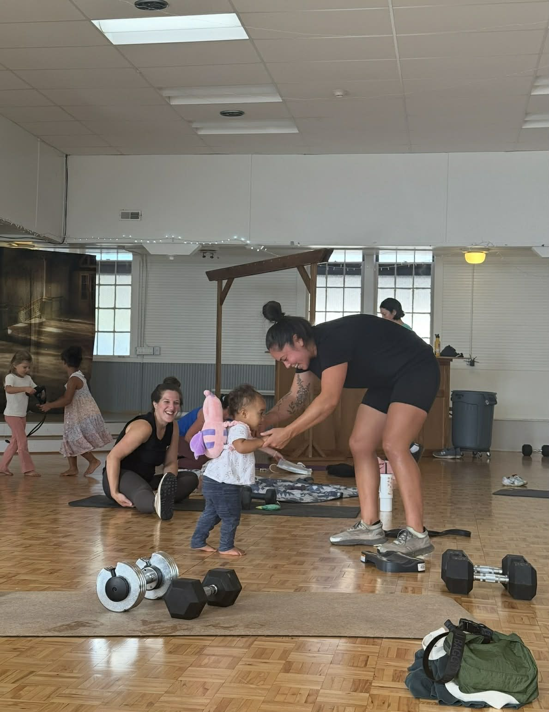

# About the Coaches

Meet the team behind All Seasons Fitness — experienced coaches who bring energy, expertise, and real-life perspective to every class.

---

## Brittany — Owner & Head Coach

Hi! I'm Brittany — proud mama to my two girls and wife to my husband, Drew. I'm originally from Humboldt County, CA, and have called Seattle home since 2010. I've been in the fitness industry for 17+ years, primarily in group coaching and gym management.

All Seasons Fitness was born when my eldest daughter arrived and I realized how few opportunities existed for parents to move their bodies with their kids in tow. These classes allow me to stay connected to the work I love while showing my daughters what strength looks like in real life. Instilling a love of movement in our kids matters deeply to me — and I'm grateful they get to watch us show up, do hard things, and take care of ourselves.

### My Coaching Style

I love fitness — and I also recognize that the fitness industry can be incredibly problematic. My goal is always to create a positive, supportive experience where people can move in a way that feels good and sustainable.

These classes focus on building strength and confidence through thoughtful movement. I'll challenge you and encourage you to go heavier when you're ready, but I'll always support you in scaling back when needed. Want to modify a workout? Cut reps? Step out for your kid? Great. Do what you need to do — I'll help you make it work.

Movement is a tool: for mental health, energy, resilience, and living your life fully (and keeping up with wild little humans if you've got them). These workouts are not a punishment for cupcakes or a quest to shrink ourselves.

And while you won't hear me talking about "earning" food — I will absolutely be watching your form, celebrating your progress, and getting genuinely excited when you pick up heavier weights or do something you once thought was impossible.

### Real Talk on Kids, Chaos & Self-Compassion

Parenting small kids is unpredictable and often chaotic — and that's exactly why these classes exist.

If you're late, wearing one shoe, or covered in breastmilk, come anyway. Low energy days are welcome. If your kid needs you mid-set, that's okay. Pregnancy and postpartum shift everything — you're not behind, broken, or starting over. You're moving, and that's what matters.

These classes aren't about perfection — they're about showing up, building strength, and feeling supported while you do it. We'll meet you where you are, adjust as needed, and keep moving forward together. I'm so glad you're here.

---

## Kristina — Coach

Hey there! I'm Kristina Taiwo — born and raised in the Pacific Northwest and a lifelong athlete at heart. I competed in track and field at the University of Washington, where I earned All-American honors and a Pac-12 title. Competing at a high level taught me a lot, but coaching and community are where I've continued to find my passion.

I've been lucky to spend the last eight years coaching everything from youth sports to college athletics, focusing on strength, speed, and overall movement across multiple sports. These days, as a stay-at-home mom, I'm rediscovering my own fitness journey—which has been a bit of a rollercoaster, to say the least. That's why I'm so grateful to have found All Seasons Fitness. I feel even luckier to now be part of this community in a way that lets me support others on their fitness journeys. I'm really looking forward to getting to know everyone and getting strong together!

---

## Katie — Coach

Hi! I'm Katie Quiniola and I've been part of the All Seasons Fitness family for a little over a year now. Prior to joining this awesome group, I've been doing bootcamp and HIIT-style workouts consistently for the past 15 years and somehow became an early morning workout person! I love starting my day with exercise and community, and I find that it leaves me energized for the rest of my day. Workouts have always been my time to do something for me -- a time to turn off my brain and leave behind any stress or worries. And now as a full-time working mom of two (Caroline is 7 and Emily is 5), I value the time more than ever.

A little about me... I'm a native Seattleite, and by day I'm a Director of Communications at Microsoft. When I'm not working I enjoy spending time with my family at our cabin on Hood Canal, a good book and the occasional wine tasting. I'm also a reality TV fan and will never turn down a conversation about all things Bravo and/or The Bachelor franchise.

I'm so grateful to be part of Brittany's community, and I love that after all these years of being coached by some great trainers I now get to pass on the gift of exercise to this group of strong, motivated and dedicated women as a coach myself!

---

"I've been going to All Seasons Fitness for several years now and it fits so many stages of life! The workouts are strength focused and Brittany (and all the coaches) are great about offering appropriate modifications for varying skill levels and pregnancy & postpartum. I love having the ability to bring kids to the workout — they play, you workout — and bonus it sets a great example for them on doing hard things!" — Emily F.

