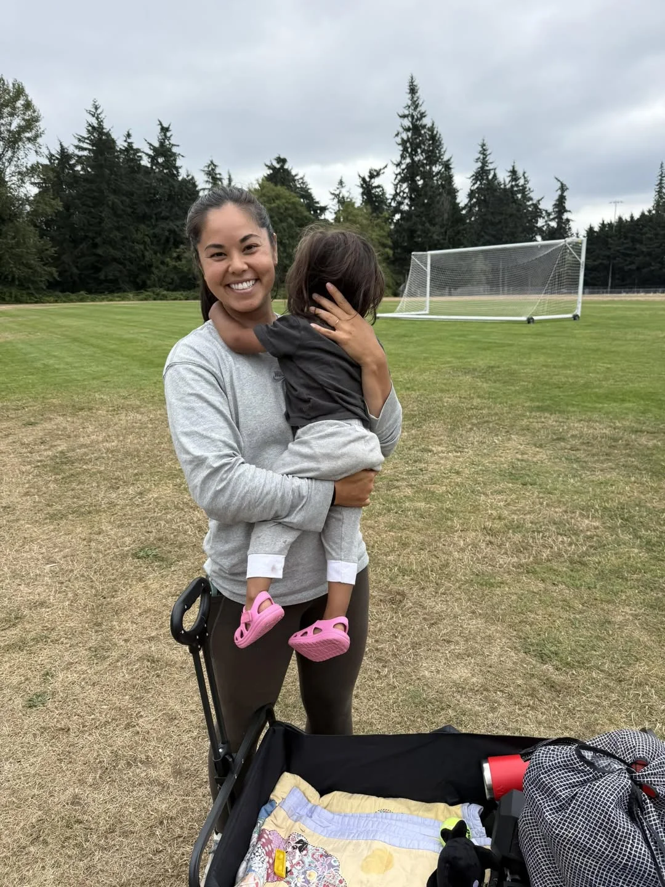

## Brittany, Owner & Head Coach

Hi! I'm Brittany, proud mama to two girls and a Pacific Northwest transplant from Humboldt County, CA. I've been in the fitness industry for almost 20 years, primarily in group coaching and gym management. All Seasons Fitness was born when my first daughter arrived and I realized how few options existed for parents who wanted to move their bodies without leaving their kids behind.

My coaching style is direct and supportive. I'll push you to go heavier when you're ready, offer modifications when you need them, and genuinely celebrate your progress. While I've always loved fitness, I think it's important to acknowledge that the fitness industry can be incredibly problematic as well. These classes are not about shrinking yourself, earning food, or punishing the body you walk in with. They're about building strength, feeling capable, and showing up consistently in a place that actually supports you.

If you're late, running on no sleep, or just having an off week.. come anyways! It's so important to me that these classes support you however it is that you need to show up. And for our mamas who are currently pregnant or postpartum? We got you here too. This community has meant so much to me and I can't wait for you to experience it too.

Thank you for being here!

---

## Kristina, Coach

Hey! I'm Kristina Taiwo, born and raised in the Pacific Northwest and a lifelong athlete. I competed in track and field at the University of Washington, where I earned All-American honors and a Pac-12 title. That experience taught me a lot about what it takes to perform, but it's coaching and community that have kept me in this field ever since.

I've spent the last eight years coaching youth and collegiate athletes, with a focus on strength, speed, and movement. I care deeply about helping people find confidence in their bodies and discover what they're capable of, whether they're competing or just trying to carve out an hour for themselves.

These days I'm a stay-at-home mom rediscovering my own fitness journey, which has been humbling, real, and honestly a little wild. Finding All Seasons Fitness gave me a place to rebuild and a community I didn't know I needed. Being part of a space that genuinely supports people, whether they're postpartum, brand new to exercise, or somewhere in between, is exactly where I want to be.

I'm so glad to coach alongside Brittany and can't wait to get to know everyone. Let's get strong together!

---

"I've been going to All Seasons Fitness for several years now and it fits so many stages of life! The workouts are strength focused and Brittany (and all the coaches) are great about offering appropriate modifications for varying skill levels and pregnancy & postpartum. Because of this I've enjoyed continuing exercise routines through having kids. And I love having the ability to bring kids to the workout: they play, you workout, and bonus it sets a great example for them on doing hard things! I'm beyond grateful for these classes and the beautiful community that Brittany has built!"
<cite>Emily F.</cite>

<a href="https://allseasonsfitness.pushpress.com/landing/plans/plan_d52a452e820d40/login" class="btn section-btn" target="_blank" rel="noopener noreferrer">Book Your Free Class</a>
<a href="/schedule.html" class="btn btn-alt">View Schedule</a>

