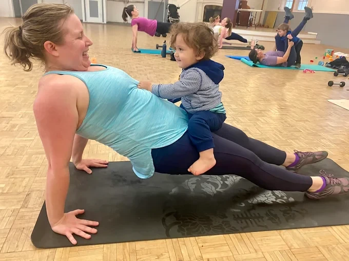
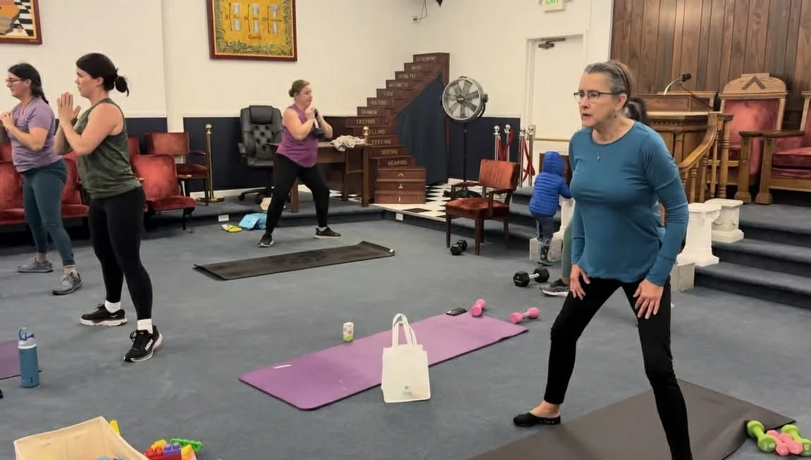
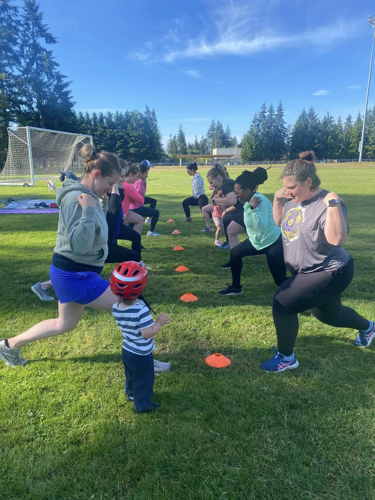
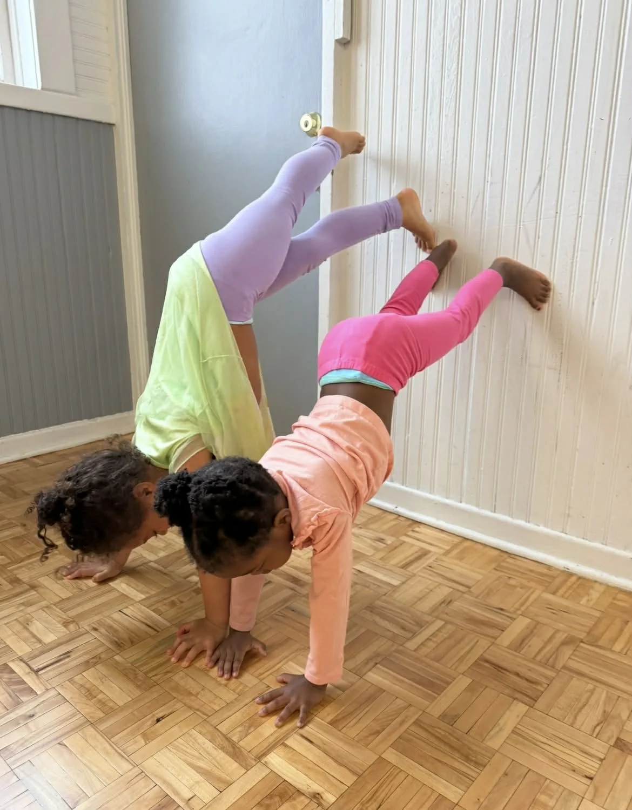

## Getting Started

**I haven't worked out in forever, will this class be okay for me?**

Yes, absolutely. Every class is designed with options for all fitness levels, from brand-new beginners to experienced athletes. You'll always be encouraged to move at your own pace, and this is a crew of people who will meet you right where you are.

**Am I too old or too young?**

Our community ranges from late 20s to early 70s, with a mix of fitness levels and life stages. Everyone moves at their own pace, and the variety makes class more fun and fulfilling for everyone.

"As I'm aging I'm concerned about strength and balance. I started with one day a week and have recently upped it to two. I've noticed great improvements in strength and flexibility. The best part? I can put on my shoes while standing, something I couldn't do in October." <cite>Ann J.</cite>

**Is this class only for women?**

Nope! Our classes are designed for all adults, regardless of gender. We welcome everyone who wants to get stronger, move more, and be part of a supportive community.

**Can I join if I'm pregnant or postpartum?**

Absolutely. Many of our members are prenatal or postpartum, and workouts are easily adjusted to meet your needs. Just let your coach know at the start of class.

**What if I need modifications?**

Every workout can be adjusted for injuries, pregnancy, postpartum needs, or whenever you're having an off day.

---

## Class Details

**How long are classes?**

Each class runs about 60 minutes, including warm-up, strength work, conditioning, and cool down.

**How many people are in a class?**

Classes typically have 6 to 15 people, with an average of around 8. It's small enough that your coach knows your name, your history, and what you're working toward.

**Where are classes held?**

We're outdoors in Mountlake Terrace June through September, and indoors at the Masonic Center in Downtown Edmonds the rest of the year. The exact spots are easy to find, and we'll give you directions when you sign up.

---

## Family-Friendly

**Can I bring my kids?**

Yes! All Seasons Fitness is family-friendly, and while kids aren't part of the workout, they are always welcome to tag along while you move.

**What do my kids do during class?**

It depends on your kiddo! Some play with others, some will stay next to you and try to climb all over you every chance they get. Sometimes the goal is just getting out of the house and getting some movement in. Bring snacks, toys, or whatever keeps them happy. If you need to nurse or step aside for a moment, that's okay too!

---

## Gear & Costs

**Do I need to sign up ahead of time?**

Yes, please do! It helps us plan class and make sure equipment is ready for you.

**What should I bring?**

Comfortable workout clothes, a water bottle, and whatever you need for your kids.

**How much does it cost?**

Your first class is free! After that, you can choose a membership or class pack that fits your schedule; see the [memberships page](/memberships.html) for more info.

**Can I pause or cancel my membership?**

Yes — cancel, pause, or downgrade anytime with 3 days notice. Upgrade whenever.

"It gave me a place I could go regularly with my baby and not feel judged if I had breast milk on my shirt or if my little one started crying mid-class. Coach Brittany made me feel welcome right away, and Coach Kristina is amazing too, both are encouraging, understanding, and really know how to make new moms feel supported." - Caleigh P.

<a href="https://allseasonsfitness.pushpress.com/landing/plans/plan_d52a452e820d40/login" class="btn section-btn" target="_blank" rel="noopener noreferrer">Book Your Free Class</a>

---

## Still Have Questions?

We'd love to hear from you. [Email Brittany](mailto:Brittany@all-seasons-fitness.com) or call [(425) 780-7466](tel:+14257807466).

