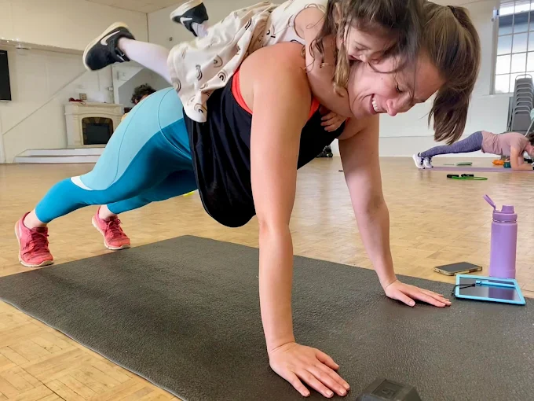

# Frequently Asked Questions

## Getting Started

**I haven't worked out in forever, will this class be okay for me?**

Every class is designed with options for all fitness levels — from brand-new beginners to experienced athletes. It's hard getting started with something new but you'll always be encouraged to move at your own pace, and this is a crew of people who welcoming and supportive of wherever you're at.

**Am I too old/young to fit in?**

Our community ranges from late 20s to early 70s, with a mix of fitness levels and life stages. Everyone moves at their own pace, and the variety makes class more fun and fulfilling for everyone.

**Is this class only for women?**

Nope! Our classes are designed for all adults, regardless of gender. We welcome everyone who wants to get stronger, move more, and be part of a supportive community.

**I'm pregnant / postpartum — can I still join?**

Absolutely. Many of our members are prenatal or postpartum, and workouts are easily adjusted to meet your needs. Just let your coach know at the start of class.

**What if I need modifications?**

No problem! Every workout can be adjusted for injuries, pregnancy, postpartum needs, or whenever you're having an off day.

## Class Details

**How long are classes?**

Each class runs about 60 minutes, including warm-up, strength work, conditioning, and cool down.

**Where are classes held?**

We're outdoors in Mountlake Terrace for part of the year, indoors at the Masonic Center in Downtown Edmonds for the rest. The exact spots are easy to find, and we'll give you directions when you sign up.

**Do I need to sign up ahead of time?**

Yes, please do! It helps us plan class and make sure equipment is ready for you.

## Family-Friendly

**Can I bring my kids?**

Yes! All Seasons Fitness is family-friendly and while kids aren't a part of the workout they are always welcome to tag along while you move.

**What do my kids do during class?**

It depends on your kiddo! Some play with others, some will stay next to you and try to climb all over you every chance they get. Sometimes the goal is just getting out of the house and getting some movement in. Bring snacks, toys, or whatever keeps them happy. If you need to nurse or step aside for a moment, that's okay too!

## Gear & Costs

**What should I bring?**

Comfortable workout clothes, a water bottle, and whatever you need for your kiddos.

**How much does it cost?**

Your first class is free! <a href="https://allseasonsfitness.pushpress.com/landing/plans/plan_d52a452e820d40/login" target="_blank" rel="noopener noreferrer">Book your first class here</a>. After that, you can choose a membership or class pack that fits your schedule - see the [memberships page](/memberships.html) for more info.
