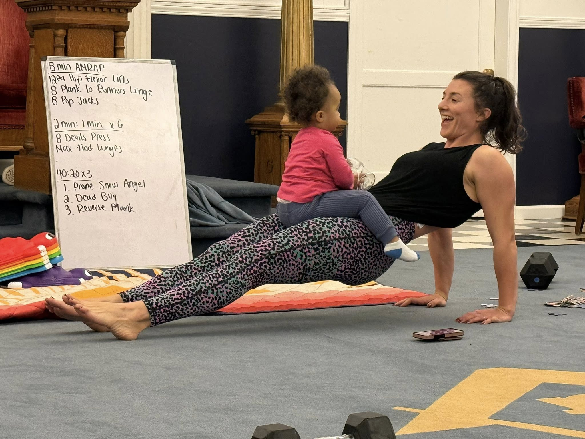
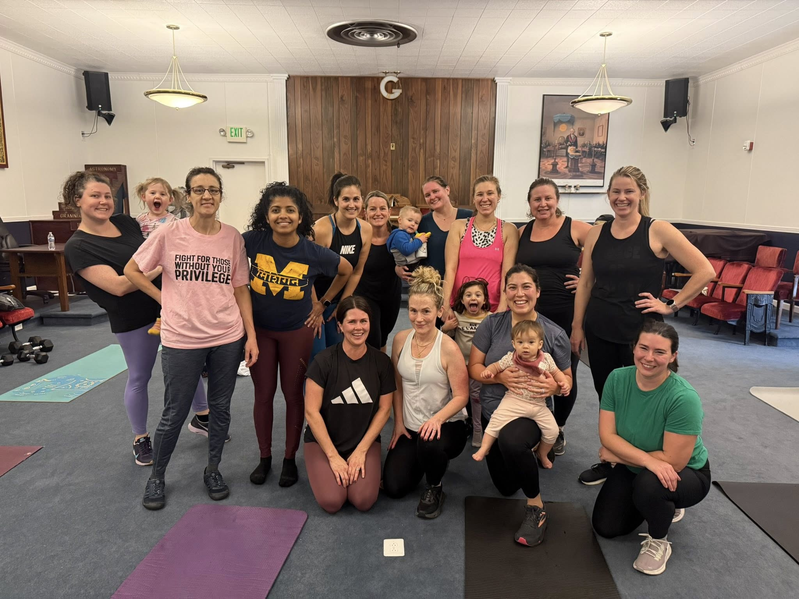
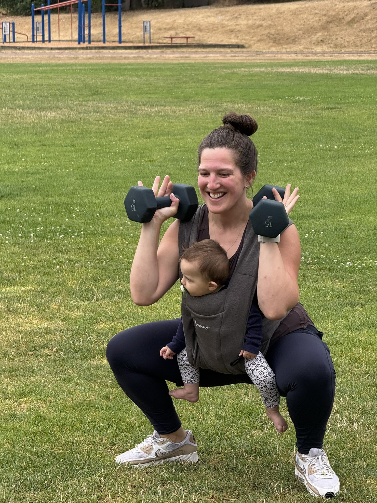

# Your First Class at All Seasons Fitness

We're so glad you're here! Your first class is free, and we'll make sure you feel welcome and ready to move. Here's everything you need to know.

---

## How to Prepare

- Wear comfortable workout clothes and athletic shoes
- Bring water and a mat (a yoga mat, towel, or outdoor blanket all work)
- Kids are welcome — bring snacks, toys, or whatever helps them stay comfortable
- All equipment is provided for your first class

---

## What Happens in Class

**Warm-Up:** We start together with a guided warm-up to get your body ready.

**Workout:** The main workout combines strength and conditioning. Your coach will demonstrate the movements, offer options, watch your form and help you adjust as needed.

**Cool Down:** We finish with a short cool down and stretch, plus a few minutes to connect before heading out.

---

## What We Ask of You

- Please arrive 10 minutes early so we can get you set up and ready to go
- Let your coach know about any injuries, pregnancy, or postpartum considerations
- Move at your own pace and take rest as needed

---

"I started going to classes when I was about 7 weeks postpartum and I am still going a couple times a week 2 years later. I love that I'm able to get a great workout and my kids have fun playing with other kids. Brittany is knowledgeable about how to workout correctly to avoid injury and she is always able to offer modifications if something doesn't feel quite right." — Annie P.

---

## Ready to Connect?

Your first class is free — we can't wait to meet you!

<a href="https://allseasonsfitness.pushpress.com/landing/plans/plan_d52a452e820d40/login" class="btn section-btn" target="_blank" rel="noopener noreferrer">Book Your Free Class</a>

Join our community for class photos & social events

<a href="https://www.facebook.com/groups/721088668952518/?ref=share&mibextid=NSMWBT" target="_blank" rel="noopener noreferrer" style="color: #36726f;">All Seasons Fitness on Facebook</a>

