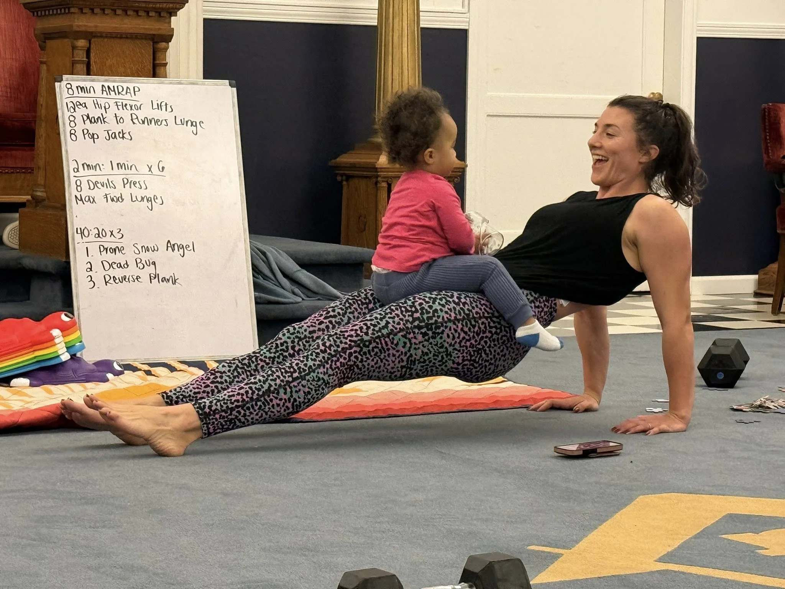
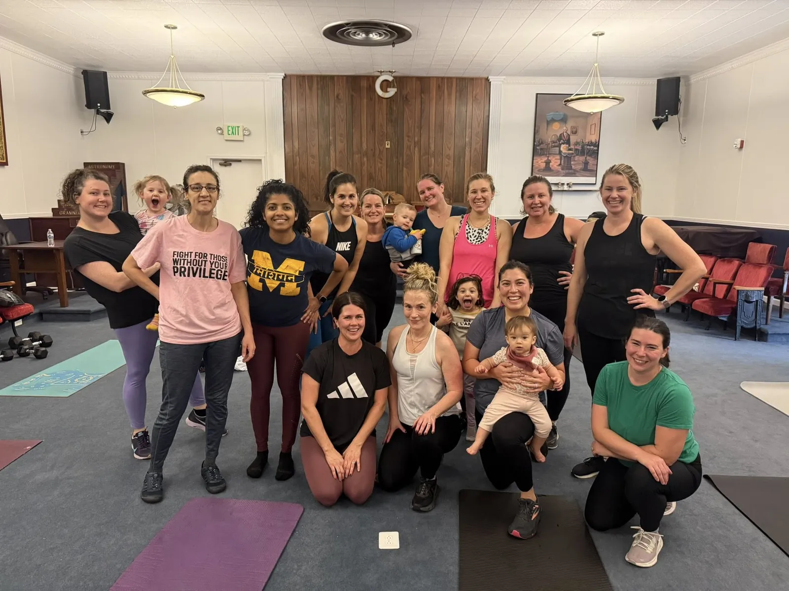

Your first class is free. Here's everything you need to know before you arrive.

Not sure what to expect from the workout itself? [See what our classes are like.](/workouts.html)

---

## What to Bring

- Comfortable workout clothes and athletic shoes
- Water and a mat (a yoga mat, towel, or outdoor blanket all work)
- Snacks, toys, or whatever helps your kids stay comfortable

All equipment is there waiting for you.

---

## When You Get There

- Your coach will reach out by text before your first class, so keep an eye out for that
- Arrive 10 minutes early so we can get you set up
- Let your coach know about any injuries, pregnancy, or postpartum considerations

---

## What Happens in Class

**Warm-Up:** We start together with a guided warm-up to get your body ready.

**Workout:** The main workout combines strength and conditioning. Your coach will demonstrate the movements, offer options, watch your form and help you adjust as needed.

**Cool Down:** We finish with a short cool down and stretch, plus a few minutes to connect before heading out.

---

"I started going to classes when I was about 7 weeks postpartum and I am still going a couple times a week 2 years later. I love that I'm able to get a great workout and my kids have fun playing with other kids. Brittany is knowledgeable about how to workout correctly to avoid injury and she is always able to offer modifications if something doesn't feel quite right." - Annie P.

---

## See You There

Come as you are. We can't wait to meet you.

<a href="https://allseasonsfitness.pushpress.com/landing/plans/plan_d52a452e820d40/login" class="btn section-btn" target="_blank" rel="noopener noreferrer">Book Your Free Class</a>

