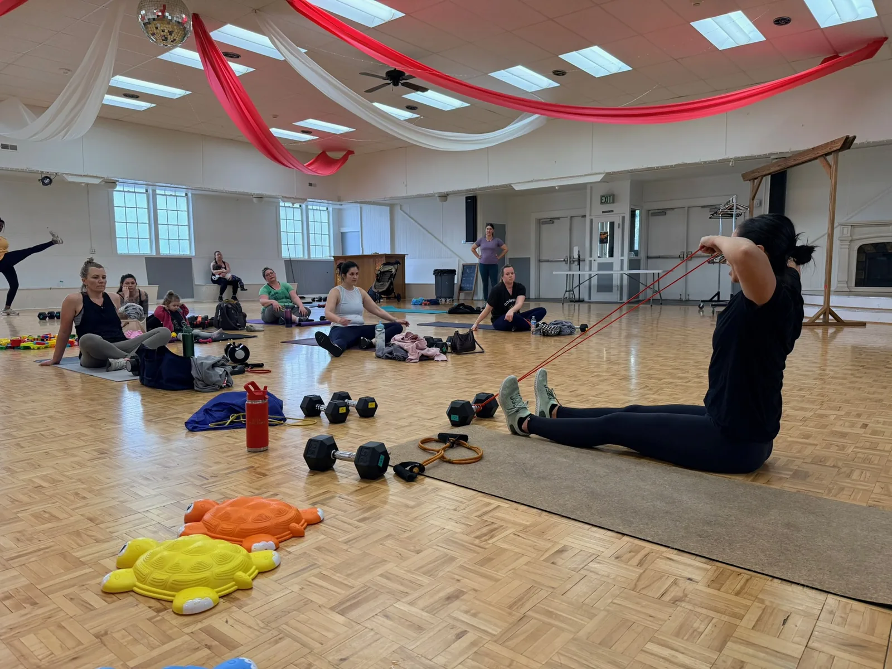
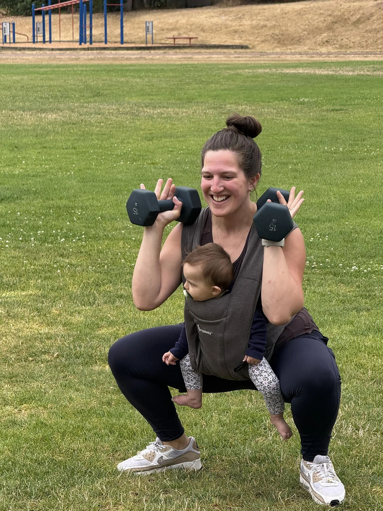

## How It Works

Tap the button below, enter your email, and we'll send you a link to pick a free class. Every workout is built with options for beginners through experienced lifters, every day is the perfect day to start!

---

## What the Hour Looks Like

Every class runs the same way: a warm-up built for that day's workout, 32–40 minutes of strength and conditioning work, and a cool-down that targets what you just trained. Your coach demonstrates every movement, helps you pick the right weights, and checks on you throughout. You'll never be left guessing what to do or how to do it. [Curious about the programming? Here's how the workouts are built.](/workouts.html)

---

## "Should I get in shape first?"

No: this is the place you get in shape, not the place you prove you already are. Whether you haven't worked out in years, you're weeks postpartum, or you've been lifting for a decade, the workout scales to you on day one. Nobody is judging, and if it feels like you're starting from scratch, there's plenty of people who understand exactly how that feels.

---

## What to Bring

- Comfortable workout clothes and athletic shoes
- Water and a mat (a yoga mat, towel, or outdoor blanket all work)
- Snacks, toys, or whatever helps your kids stay comfortable

<small style="color: #888;">Weights will be provided on your first class.</small>

---

## Bringing Kids?

They're genuinely welcome anytime! This whole thing was built so parents wouldn't have to choose between working out and being with their kids. Some kids play together, some sit with snacks, and some will be using you as a jungle gym every chance they get. All of it is normal here, and no one will bat an eye if you pause mid-set to handle a moment.

We also 100% understand and respect the need for a kid free workout if you want to leave them at home. No judgement either way.

---

## When You Get There

Your coach will text you before your first class to check in on your injuries, ask questions and help you with everything you need, including exactly where to find us. We're outdoors in Mountlake Terrace June through September and indoors at the Masonic Center in Downtown Edmonds the rest of the year.

Plan to arrive 10 minutes early so you can settle in, meet your coach, and get set up without rushing.

---

"I started going to classes when I was about 7 weeks postpartum and I am still going a couple times a week 2 years later. I love that I'm able to get a great workout and my kids have fun playing with other kids. Brittany is knowledgeable about how to workout correctly to avoid injury and she is always able to offer modifications if something doesn't feel quite right."
<cite>Annie P.</cite>

---

<a href="https://allseasonsfitness.pushpress.com/landing/plans/plan_d52a452e820d40/login" class="btn section-btn" target="_blank" rel="noopener noreferrer">Book Your Free Class</a>

