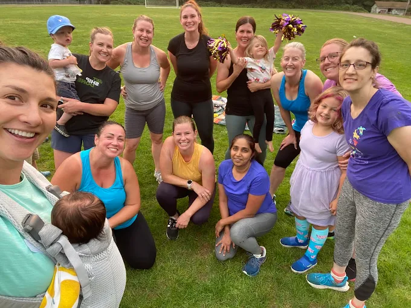

# Your First Class

Showing up for your first class can feel a little intimidating — we get it! Here’s what to expect and how to prepare so you can dive in confidently.

## What Happens in Class

1. **Warm-Up** – We’ll move together to get your body ready.
2. **Guided Workout** – Exercises are led by your coach and can be scaled to your fitness level.
3. **Cool Down & Stretch** – Time to recover and celebrate what you did!

## How to Prepare

- Wear comfortable workout clothes and shoes.
- Bring a water bottle & a mat (yoga mat, outdoor blanket.. it all works!)
- Kids are welcome — bring snacks, toys, or whatever keeps them happy. 
- Don’t worry about equipment — we provide dumbbells for your first class.

## What We Ask of You

- Arrive 5–10 minutes early so we can greet you and get you set up.
- Let your coach know about any injuries, pregnancy, or postpartum needs.
- Come ready to move at your own pace and have fun — no expectations, no judgment.

## Ready to Join?

Your first class is **FREE**. Just fill out a short form and you'll receive a link to book your first class. 
  

<a href="https://allseasonsfitness.pushpress.com/open/interested/" class="btn section-btn" target="_blank" rel="noopener noreferrer">Sign up for my first class!</a>

 

 

Join in our FB group to gain access to all the pictures from class as well as monthly social events & community building opportunities.

<a href="https://www.facebook.com/groups/721088668952518/?ref=share&mibextid=NSMWBT" class="btn section-btn" target="_blank" rel="noopener noreferrer">All Seasons Fitness</a>

