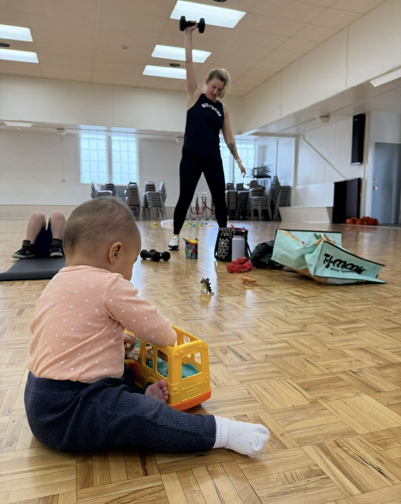

All Seasons Fitness is a community-based strength training gym built for real life. Our classes blend strength, conditioning, and core work in a way that's challenging, adaptable, and sustainable — without the pressure to show up as anything other than yourself.

<a href="https://allseasonsfitness.pushpress.com/landing/plans/plan_d52a452e820d40/login" class="btn section-btn" target="_blank" rel="noopener noreferrer">Book Your Free Class</a>
<a href="/schedule.html" class="btn section-btn">View Schedule</a>

## Who It's For

We welcome all genders and all fitness backgrounds. Many of our members are balancing busy schedules, family life, and everything in between. Whether you're:

- Brand new to fitness
- A long-time athlete and parent
- Pregnant or rebuilding strength postpartum
- Simply looking for consistent, effective workouts

You'll find coaching that meets you where you are and a community that genuinely cares.

## What to Expect

- Kids are welcome — bring them along while you move
- Modifications always offered — for any ability or stage of life
- Supportive environment — showing up as you are is always enough

"As a physical therapist, it is important to me that the workouts I do are designed and facilitated by someone who knows their stuff, and with decades in the coaching industry, Brittany is just that! Brittany creates community wherever she goes, and genuinely works to create an inclusive and transformative space for all those who show up." — Chelsea A.

---

## Connect With Us

Join the All Seasons Fitness Facebook group for updates, pictures, and events!

<a href="https://www.facebook.com/groups/721088668952518/?ref=share&mibextid=NSMWBT" class="btn section-btn" target="_blank" rel="noopener noreferrer">All Seasons Fitness</a>

Location: Edmonds & Mountlake Terrace, WA

Contact: <a href="mailto:Brittany@all-seasons-fitness.com">Brittany@all-seasons-fitness.com</a>

