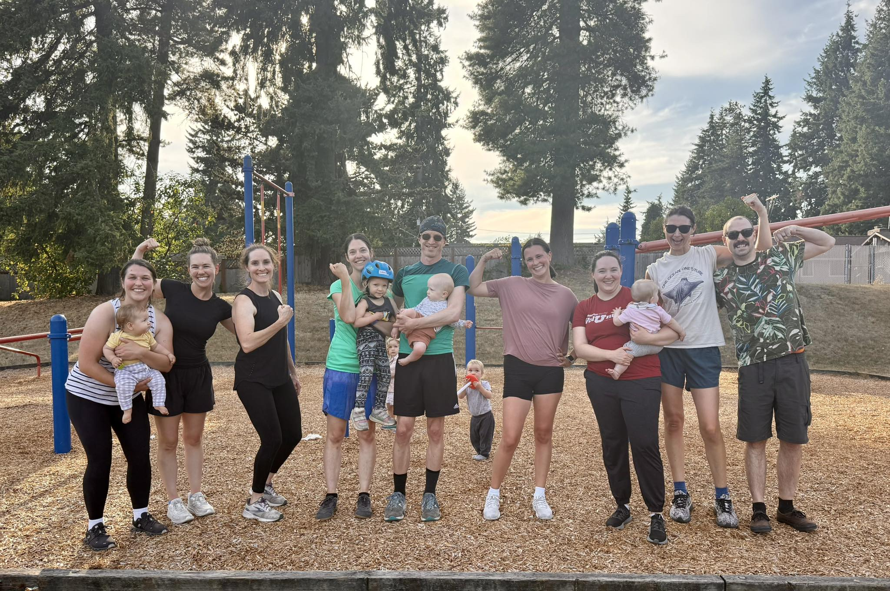

All Seasons Fitness is a community-based strength training gym built for real life. Our classes blend strength, conditioning, and core work in a way that's challenging, adaptable, and sustainable — without pressure to look a certain way or perform at a certain level. We welcome all genders and all fitness backgrounds, as many of our members are balancing busy schedules, family life, and everything in between. Whether you're brand new, a long time athlete and parent, pregnant, rebuilding strength postpartum, or simply looking for consistent, effective workouts in a supportive space, you'll find coaching that meets you where you are and a community that genuinely cares. Kids are welcome, modifications are always offered, and showing up — as you are — is always enough.

Join the All Seasons Fitness Facebook group for regular updates, pictures, upcoming events, and more!

<a href="https://www.facebook.com/groups/721088668952518/?ref=share&mibextid=NSMWBT" class="btn section-btn" target="_blank" rel="noopener noreferrer">All Seasons Fitness</a>

* * *

# Contact

<a href="mailto:brittany.allseasonsfitness@gmail.com">brittany.allseasonsfitness@gmail.com</a>

 

<!--  -->
