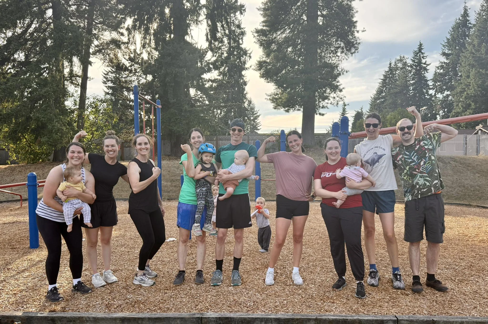
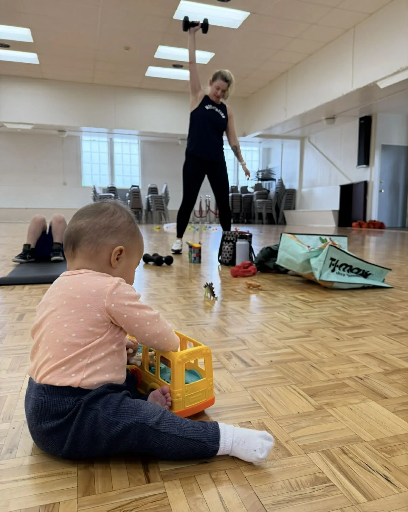

Coaches who know your name, prices that won't break the bank, and a community that truly shows up for each other.

<a href="https://allseasonsfitness.pushpress.com/landing/plans/plan_d52a452e820d40/login" class="btn section-btn" target="_blank" rel="noopener noreferrer">Book Your Free Class</a>
<a href="/schedule.html" class="btn btn-alt">View Schedule</a>

## Who It's For

We welcome all genders and all fitness backgrounds. Whether you're:

- Brand new to fitness
- A long-time athlete and parent
- Pregnant or rebuilding strength postpartum
- Looking for consistent, effective workouts

You'll find coaching that meets you where you are and a community that genuinely cares.

## What to Expect

- Kids are welcome — bring them along while you move
- Supportive environment — showing up as you are is always enough

## The Workouts

**Programmed for the year. Each workout has its purpose.**

Every ASF session comes from a full-year training plan, and we're looking at more than just a random leg day and arm day. We train strength, power, agility, balance, mobility, single-leg work, rotation — everything a body needs to do. It's programmed on purpose across every plane you move in, and sequenced so it builds week to week. Movements never repeat two classes in a row, and every month is stress-tested before it hits the floor.

- **Heavy when it should be. Never two workouts in a row.** The program is balanced against real attendance patterns, so your hardest sessions land when you're fresh enough to gain something from them. You'll work every class. You'll never dread the next one.
- **One hour, zero filler.** A warm-up built for that day's lifts, at least 32 minutes of real work, and a cool-down that targets exactly what you loaded. In and out in 60.
- **Scaled for whoever shows up.** Every session is written with modification paths already built in, before it's ever coached. Coming back from an injury, brand new to lifting, pregnant or postpartum, or chasing a heavier dumbbell than last month: your coach already knows your version of today's workout and will help you through it.
- **Dumbbells, bands, and smart programming.** That's it. That's the whole equipment list. The challenge comes from design — tempo, volume, density — not from more stuff.

<small><em>Outdoors June through September, indoors the rest of the year. All seasons, all year.</em></small>

[See how a class runs →](/workouts.html)

"As a physical therapist, it is important to me that the workouts I do are designed and facilitated by someone who knows their stuff, and with decades in the coaching industry, Brittany is just that! Brittany creates community wherever she goes, and genuinely works to create an inclusive and transformative space for all those who show up." - Chelsea A.

---

<h2>Stay in the Loop</h2>

Get our monthly updates, schedule changes, and event invites. No spam, ever.

<form action="https://all-seasons-fitness.us3.list-manage.com/subscribe/post?u=af30da5a7004758f9b2a0a65c&amp;id=caad5066fd&amp;f_id=0058d2e1f0" method="post" id="mc-embedded-subscribe-form" name="mc-embedded-subscribe-form" class="validate" target="_blank">

<input type="text" name="FNAME" id="mce-FNAME" placeholder="First name" class="mc-input" aria-label="First name">
<input type="email" name="EMAIL" id="mce-EMAIL" placeholder="Email address" required class="mc-input" aria-label="Email address">

<button type="submit" name="subscribe" id="mc-embedded-subscribe" class="btn section-btn">Sign Me Up</button>

<input type="text" name="b_af30da5a7004758f9b2a0a65c_caad5066fd" tabindex="-1" value="">

</form>

---

## Ready to try a class?

Your first class is free, kids welcome.

<a href="https://allseasonsfitness.pushpress.com/landing/plans/plan_d52a452e820d40/login" class="btn section-btn" target="_blank" rel="noopener noreferrer">Book Your Free Class</a>

