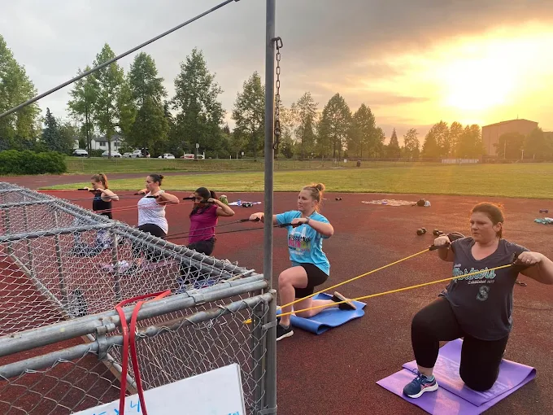

All Seasons Fitness was created to give people a place to move, connect, and get stronger — without the pressure to shrink, "bounce back" or show up looking perfectly put together.

Our classes combine strength training, cardio, and core in a way that’s challenging but always adaptable. Whether you're pregnant, postpartum, starting fresh, or deep into your fitness journey, you'll find workouts that support your goals and a community that cheers you on. Kids are welcome. Modifications are always offered. And showing up imperfectly is more than enough.

Classes are held outdoors in Mountlake Terrace during the spring/summer months, and indoors in Downtown Edmonds when the weather turns cold.

Join the All Seasons Fitness Facebook group for regular updates, pictures, upcoming events, and more!

<a href="https://www.facebook.com/groups/721088668952518/?ref=share&mibextid=NSMWBT" class="btn section-btn" target="_blank" rel="noopener noreferrer">All Seasons Fitness</a>

* * *

# Contact

<a href="mailto:brittany.allseasonsfitness@gmail.com">brittany.allseasonsfitness@gmail.com</a>

 

<!--  -->
