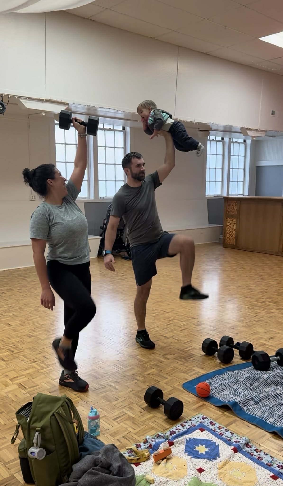

# Memberships, Class Packs & Drop-Ins

Simple options. No long commitments. Choose what fits your schedule and join the community whenever you're able.

---

## First Class is Free!

The hardest part is often walking in the door. Come as you are, try us out, and see if it feels like a fit.

<a href="https://allseasonsfitness.pushpress.com/landing/plans/plan_d52a452e820d40/login" class="btn section-btn" target="_blank" rel="noopener noreferrer">Book Your Free Class</a>

---

## Monthly Memberships

**4x / month — $62**
A good starting point for building a routine or training once per week.

**8x / month — $118**
Ideal for training 2x per week, where strength gains and progress start to compound.

**Unlimited — $145 ⭐ Best Value**
Best for members training 2–3x per week or more, or anyone wanting flexibility week to week.

---

## Class Packs & Drop-Ins

**10-Class Pack — $170** (expires in 6 months)

**20-Class Pack — $320** (expires in 6 months)

**Drop-In — $20**
A good fit if your availability changes month to month or you prefer pay-as-you-go.

---

## Sign Up & Book

All memberships, class packs, and reservations are managed through PushPress. Access to the All Seasons Fitness app will begin when you start a membership.

<a href="https://allseasonsfitness.pushpress.com/landing/plans/plan_d52a452e820d40/login" class="btn section-btn" target="_blank" rel="noopener noreferrer">Get Started</a>

