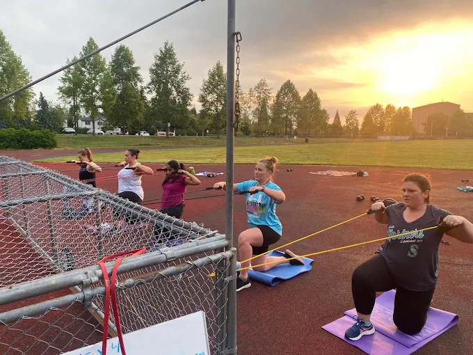
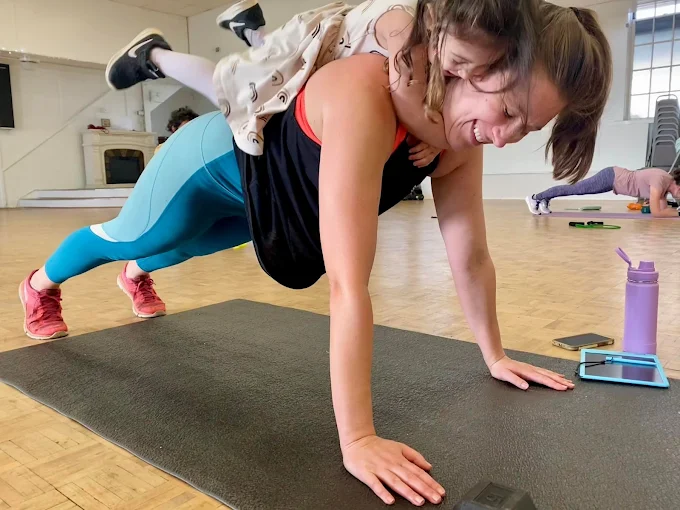
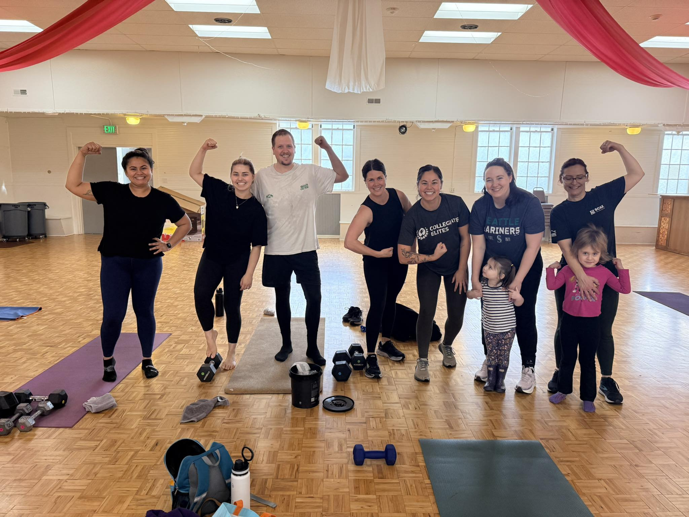
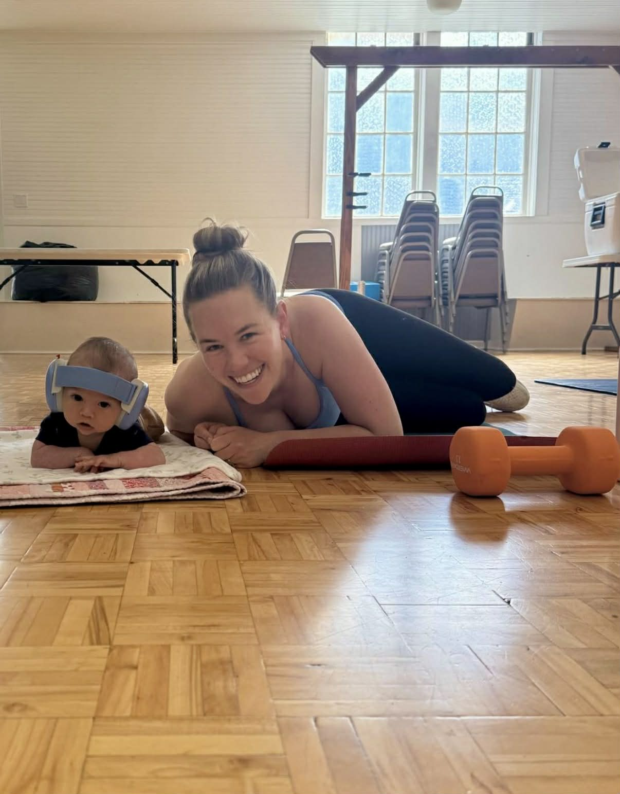

# Reviews and Testimonials

We're proud of the community we've built at All Seasons Fitness. Here's what some of our members have to say about us:

---

## Member Voices

"All Seasons Fitness embraces real life. Being able to bring your kids along to the workout is such a gift—it removes one of the biggest barriers to self-care for me and creates a welcoming, judgment-free space." — Virginia K.

---

"I find these classes much more versatile and custom for my body. I'm not the most athletic and have limited mobility but I don't feel pushed beyond my limit or judged while I'm in this space. Everyone is so supportive, kind while focusing on their own goals." — Megan L.

---

"The owner/main instructor Brittany is the coolest. Her whole vibe is amazing! She has fresh workouts every week with new challenging EMOMS and AMRAPS with great music, too. Totally inspiring!!" — Lauren A.

---

"One of my favorite things is how inclusive and fun Brittany is. Coming in new and also not being a mom I wondered how/if I'd fit into the group (also being an introvert) but Britt makes it gentle and easy." — Natalia G.

---

## From Google Reviews

⭐⭐⭐⭐⭐ "Brittany is the best. She brings the most positive and encouraging energy into our workouts and really meets people where they're at. I've been going to her classes for the last 2 years, and I love the workouts AND the community she has worked to build. It feels like we're all in it together, which is a great feeling. It's also AMAZING having a class that allows children. I like that I don't have to pay extra for childcare while working out, my kiddo and I get to hang out while I work out, and he sees me focusing on being strong for myself and my family, and modeling the importance of exercise. I don't know of anything else like this, and I'm so grateful to Brittany for creating this community." — Laurel E.

---

⭐⭐⭐⭐⭐ "All Seasons Fitness is amazing! Brittany offers not only a wealth of experience and knowledge but brings a warm, welcoming energy to every class. She meets folks where they're at and is quick to offer modifications where needed. She's also quick to suggest a heavier weight when she knows you're stronger than you give yourself credit for! One of my favorite parts about All Seasons is the community Brittany has fostered. It's amazing to see folks grow in their fitness journey and cheer one another on. My daughter has been coming with me to classes for years and it's been incredible to see her grow-up surrounded by a strong, supportive community." — Elizabeth M.

---

⭐⭐⭐⭐⭐ "I have been working out with Brittany at All Seasons Fitness for over 2.5 years. It is my favorite workout class I have ever done, and even better I get to bring my daughter along and show her all different types of strong women! I love going to class and feeling strong, I love the variety and I love that you can go to Brittany with any issue you are having and she will work with you and offer modifications or alternatives. It's not just a workout class though, she has created a community. We have made connections with each other outside of class and enjoy trying new activities together both with and without our children." — Elisse V.

---

⭐⭐⭐⭐⭐ "I started going to these workouts at 9 weeks postpartum, and I'm approaching a year with Brittany and the coaches. The strength and recovery out of postpartum have been instrumental. I've drastically dropped my physical therapy appointments as the strength I've gained have benefited old injuries. Our child says 'mama strong arms' and loves attending class as well. All ages and bodies are warmly welcomed in this class. Gain strength, stability, friends and have a great time!" — Amanda H.

---

⭐⭐⭐⭐⭐ "I'm so happy I found All Seasons Fitness! Not only is it an amazing & supportive community, but Brittany also puts together these incredibly effective, super tailored workouts that have made me feel strong and confident and proud of myself. I never feel any of the aches and pains I have from other workouts which I think speaks to how well she plans out the circuits and exercises." — Breanna C.

---

⭐⭐⭐⭐⭐ "I can't recommend All Seasons Fitness enough. Brittany's classes have been incredibly helpful in building back strength and stability postpartum. Brittany provides a great mix to the class structure, so you never have to worry about getting bored with repetitive workouts. The inviting and supportive environment alongside others in various stages of life makes it all the more special." — Brianna C.

---

<a href="https://share.google/zhdQcO1b18eSTSGla" class="btn section-btn" target="_blank" rel="noopener noreferrer">More on Google</a>

---

<a href="https://allseasonsfitness.pushpress.com/landing/plans/plan_d52a452e820d40/login" class="btn section-btn" target="_blank" rel="noopener noreferrer">Book Your Free Class</a>

