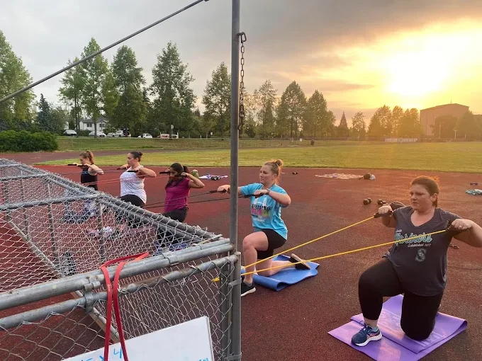
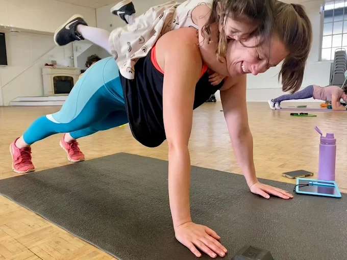
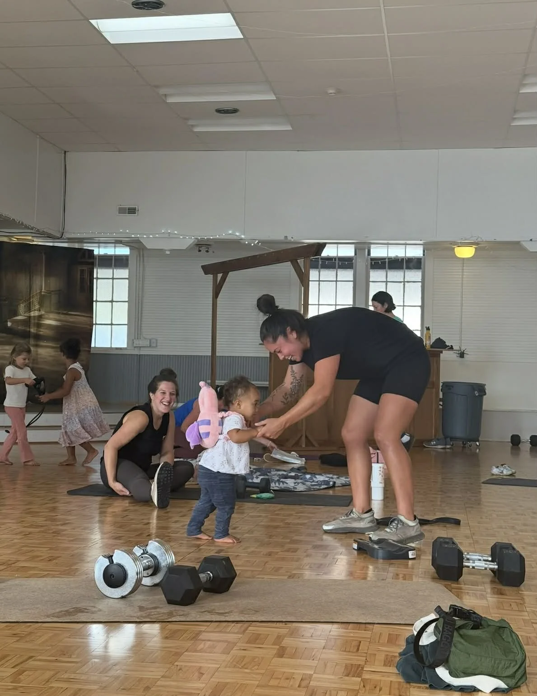
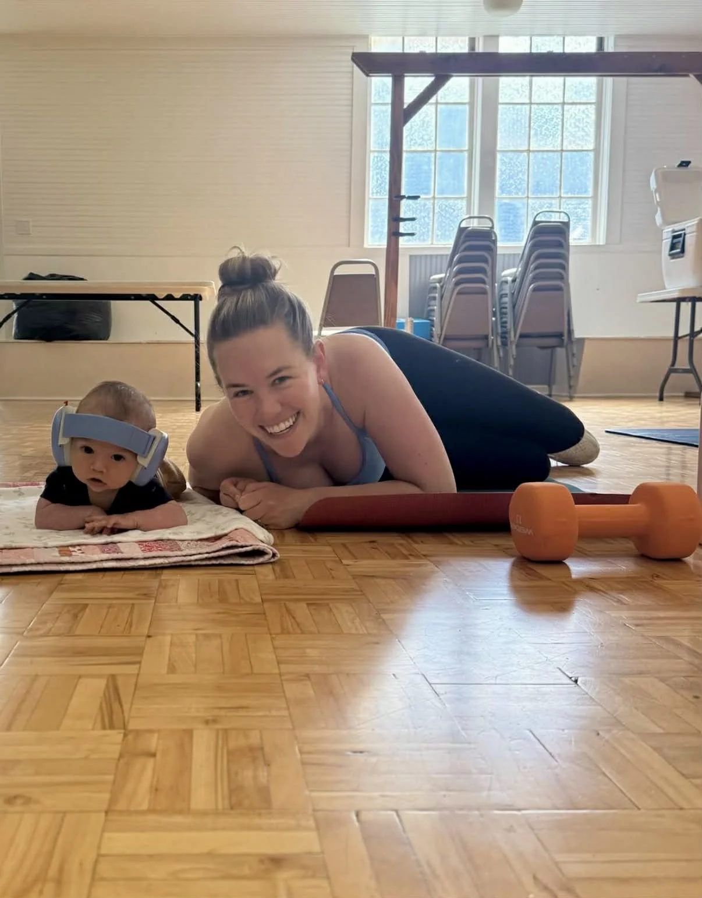

## What Members Are Saying

⭐⭐⭐⭐⭐

"All Seasons Fitness embraces real life. Being able to bring your kids along to the workout is such a gift, it removes one of the biggest barriers to self-care for me and creates a welcoming, judgment-free space."
<cite>Virginia K.</cite>

⭐⭐⭐⭐⭐

"I find these classes much more versatile and custom for my body. I'm not the most athletic and have limited mobility but I don't feel pushed beyond my limit or judged while I'm in this space. Everyone is so supportive, kind while focusing on their own goals."
<cite>Megan L.</cite>

⭐⭐⭐⭐⭐

"It's no exaggeration to say finding this class may have changed my life! I used to do a lot of sports in school but with each pregnancy I got more and more unfit, then there's the mum guilt of working out taking time away from your kid. I had been looking for something like this for so long and then stumbled across a class in the park and was so excited. The workouts are such high level, while also being completely inclusive and adaptable to all levels of fitness. Seeing myself slowly get stronger at my own pace has been the best. Getting to do it while bonding with my daughter at the same time is just the cherry on top."
<cite>Funke W.</cite>

⭐⭐⭐⭐⭐

"All Seasons Fitness has been a lifesaver and a life CHANGER. I absolutely love this bootcamp! It's one of the few places where I can bring my children to class, which has made staying active so much more doable. The community is incredibly kind, inclusive, and genuinely supportive. Coaches Brittany and Kristina create a positive atmosphere, guiding every workout and making sure form is correct. They celebrate the wins with you like moving up to heavier weights! The workouts are great for all fitness levels, and they've been especially wonderful for me as a postpartum mom. I always feel safe and encouraged."
<cite>Devon C.</cite>

---

## From Google Reviews

⭐⭐⭐⭐⭐

"Brittany is the best. She brings the most positive and encouraging energy into our workouts and really meets people where they're at. I've been going to her classes for the last 2 years, and I love the workouts AND the community she has worked to build. It feels like we're all in it together, which is a great feeling. It's also AMAZING having a class that allows children. I like that I don't have to pay extra for childcare while working out, my kiddo and I get to hang out while I work out, and he sees me focusing on being strong for myself and my family, and modeling the importance of exercise. I don't know of anything else like this, and I'm so grateful to Brittany for creating this community."
<cite>Laurel E.</cite>

⭐⭐⭐⭐⭐

"All Seasons Fitness is amazing! Brittany offers not only a wealth of experience and knowledge but brings a warm, welcoming energy to every class. She meets folks where they're at and is quick to offer modifications where needed. She's also quick to suggest a heavier weight when she knows you're stronger than you give yourself credit for! One of my favorite parts about All Seasons is the community Brittany has fostered. It's amazing to see folks grow in their fitness journey and cheer one another on. My daughter has been coming with me to classes for years and it's been incredible to see her grow-up surrounded by a strong, supportive community."
<cite>Elizabeth M.</cite>

⭐⭐⭐⭐⭐

"I have been working out with Brittany at All Seasons Fitness for over 2.5 years. It is my favorite workout class I have ever done, and even better I get to bring my daughter along and show her all different types of strong women! I love going to class and feeling strong, I love the variety and I love that you can go to Brittany with any issue you are having and she will work with you and offer modifications or alternatives. It's not just a workout class though, she has created a community. We have made connections with each other outside of class and enjoy trying new activities together both with and without our children."
<cite>Elisse V.</cite>

⭐⭐⭐⭐⭐

"I started going to these workouts at 9 weeks postpartum, and I'm approaching a year with Brittany and Kristina. The strength and recovery out of postpartum have been instrumental. I've drastically dropped my physical therapy appointments as the strength I've gained have benefited old injuries. Our child says 'mama strong arms' and loves attending class as well. All ages and bodies are warmly welcomed in this class. Gain strength, stability, friends and have a great time!"
<cite>Amanda H.</cite>

⭐⭐⭐⭐⭐

"I'm so happy I found All Seasons Fitness! Not only is it an amazing & supportive community, but Brittany also puts together these incredibly effective, super tailored workouts that have made me feel strong and confident and proud of myself. I never feel any of the aches and pains I have from other workouts which I think speaks to how well she plans out the circuits and exercises."
<cite>Breanna C.</cite>

⭐⭐⭐⭐⭐

"I started with All Seasons Fitness in October 2025. I hadn't done consistent strength training in about a year and as I'm aging I'm concerned about strength and balance. I love the vibe of the group, very welcoming and inclusive. Both Brittany and Kristina provide a great workout and suggest modifications that are helpful. I started with one day a week and have recently upped it to two days. I've noticed great improvements in strength and flexibility. The best part? I can put on my shoes while standing, something I couldn't do in October. I absolutely recommend."
<cite>Ann J.</cite>

---

Love your classes? Help others find us.

<a href="https://share.google/zhdQcO1b18eSTSGla" class="btn btn-alt" target="_blank" rel="noopener noreferrer">Leave a Google Review</a>

<a href="https://allseasonsfitness.pushpress.com/landing/plans/plan_d52a452e820d40/login" class="btn section-btn" target="_blank" rel="noopener noreferrer">Book Your Free Class</a>

