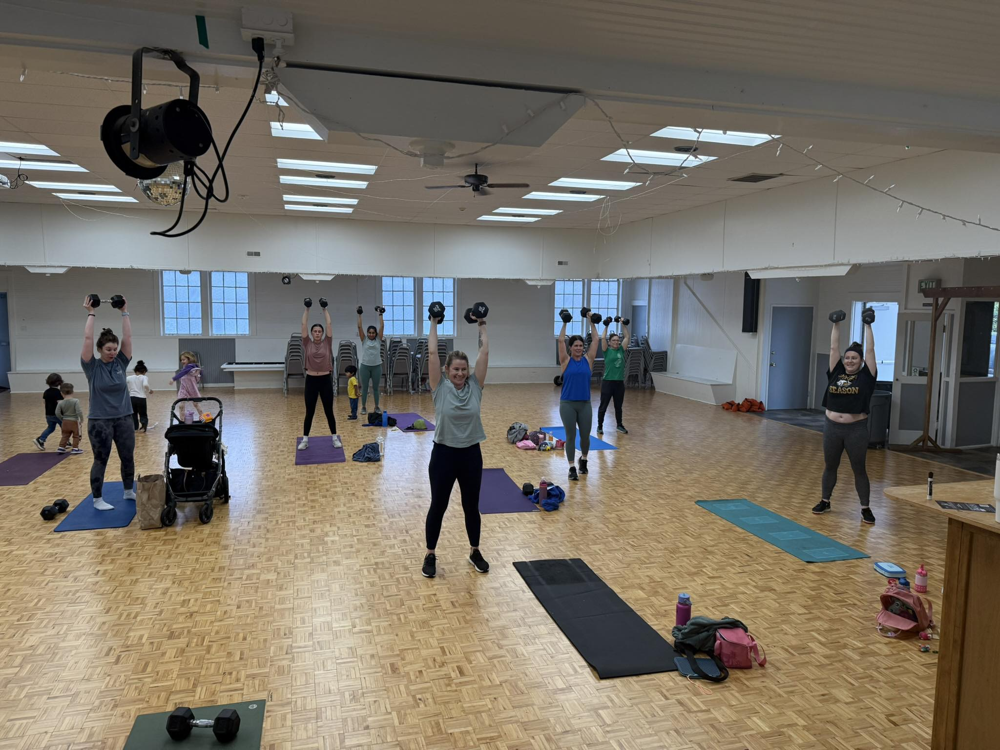
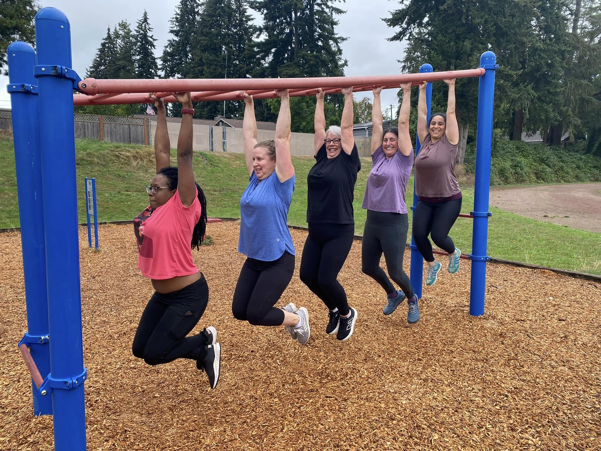
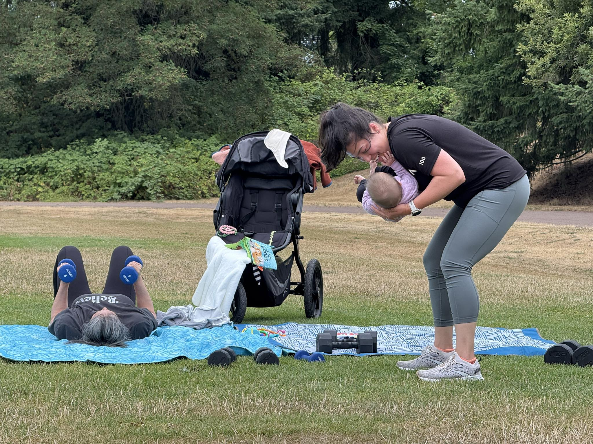

# About the Workouts

Our classes blend strength, conditioning, and core work in a format that's effective, adaptable, and built for real life. Whether you're new to fitness or a seasoned athlete, you'll find a workout that challenges you and meets you where you are.

---

## Class Details

**Who it's for:**
All fitness levels are welcome. Classes are programmed at an intermediate level, with clear options to scale up or down so everyone can train safely and effectively.

**Class length:**
60 minutes

**Style:**
Bootcamp / CrossFit-inspired training with an emphasis on functional strength, strength-based endurance, and efficient conditioning.

**Class flow:**
Each class includes a guided warm-up, a focused strength and conditioning workout (32–40 minutes), and time to cool down, stretch, and connect at the end.

---

## What to Expect

**Equipment:**
Dumbbells are used in every class, with occasional resistance bands and other simple equipment mixed in.

**Kids:**
Kids are welcome to hang out during class. Many members bring theirs, and we aim to keep the environment relaxed and realistic.

**Environment:**
Supportive, non-intimidating, and community-driven. Strong coaching without the pressure or performative gym culture.

---

## Logistics

**What to bring:**
Water, a mat if you like one, and anything your kiddo may need.

**Location:**
Classes are held in the Mountlake Terrace / Edmonds, WA area. Locations may change seasonally — check the current schedule for details.

---

"I had been doing HIIT classes for a long time but felt like my body just couldn't keep up with the high intensity anymore. I was looking for something lower intensity, but everything I tried didn't feel like a real workout. Enter All Seasons Fitness. The strength-focused workouts get my heart rate up, challenge me, and most importantly I leave feeling accomplished every single time." — Katie Q.

