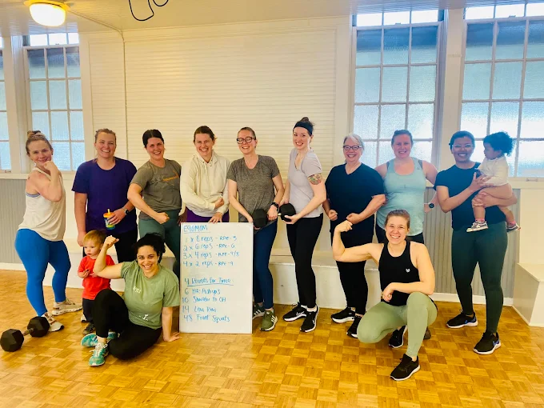
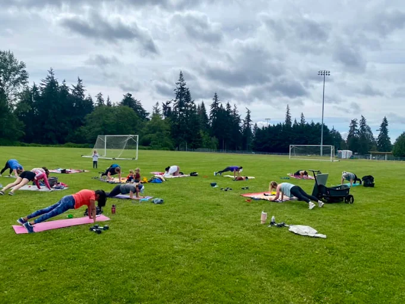

# About the Workouts

- **Who should come**: Anyone and everyone! If you're cleared and safe to exercise, you're welcome to join the crew. I program classes to the intermediate level and will scale things up or down according to your needs.
- **Length**: 60 minutes
- **Style**: Bootcamp/CrossFit-inspired, with an emphasis on functional strength through strength based endurance training
- **Class structure**: 10 min warm up, 32-40 min workout, followed by a short cool down, stretch and mingle
- **Equipment**: Dumbbells, with the occasional use of resistance bands & other equipment
- **Kids?**: Totally welcome to tag along!
- **Environment**: Non intimidating, family friendly & community-driven
- **What to bring**: Water, a mat, and anything your kiddo might need

Classes are located in the Mountlake Terrace / Edmonds WA area. Locations can change throughout the year. Check the current schedule for details.

