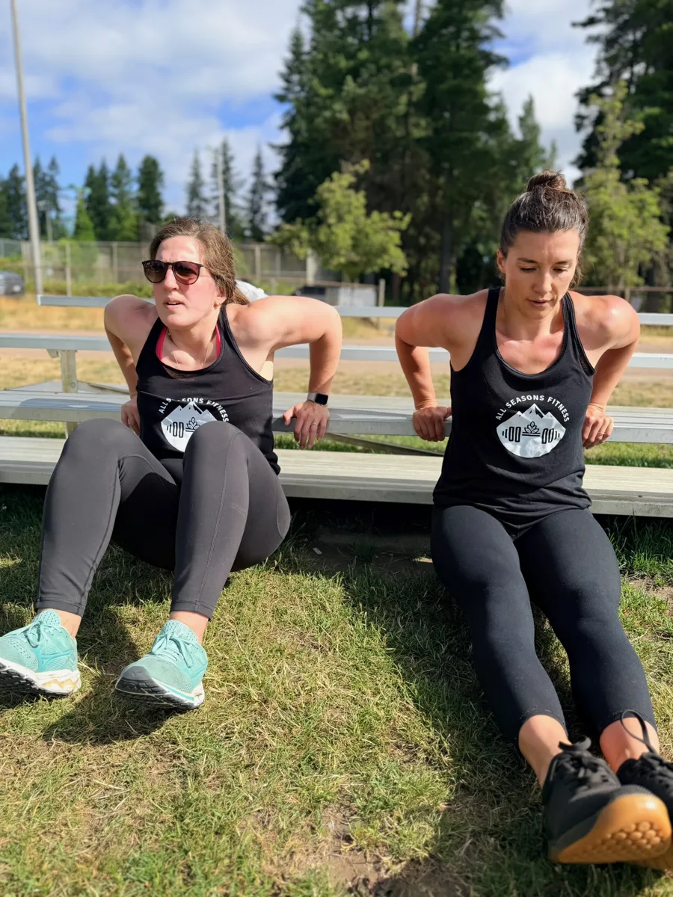
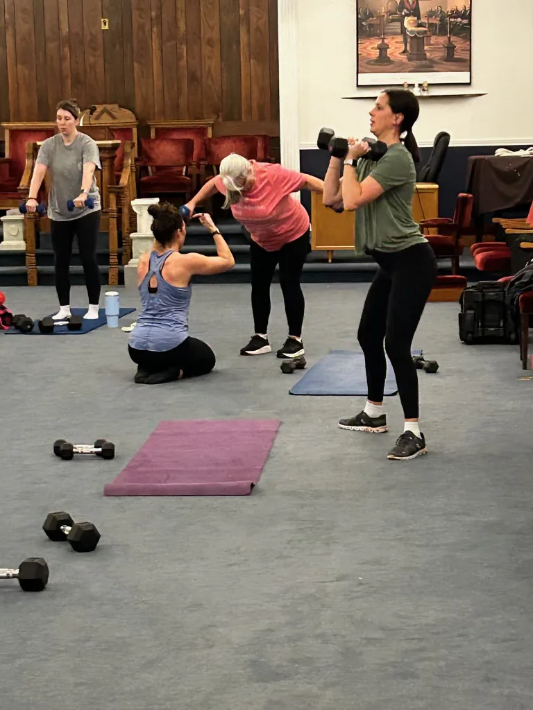
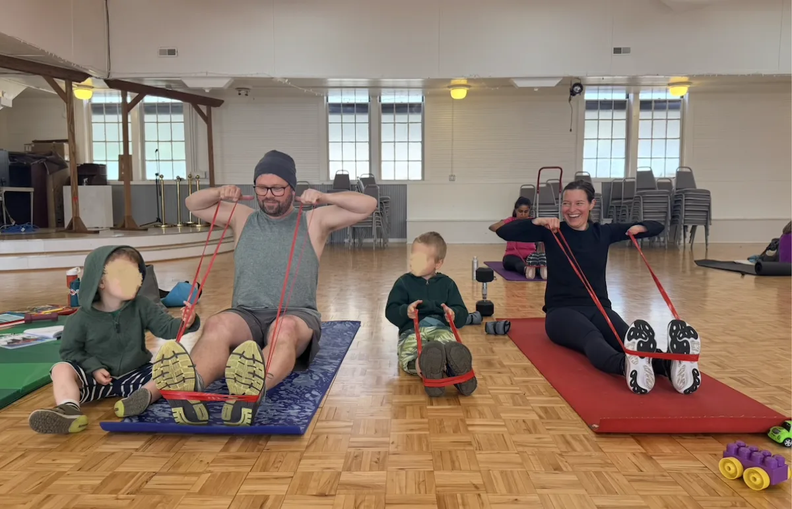

## What to Expect

Our All Seasons Strength & Conditioning classes, all an hour long, are designed for all fitness levels. You'll get a guided warm-up, 32-40 minutes of strength and conditioning work, and time to cool down and connect at the end. Every workout is thoughtfully programmed for real bodies (including pre- and postnatal), with strength, conditioning, and core work that build on each other week to week. Modifications are built into every movement, so you can scale up or down to meet your body where it is.

Classes typically have 6 to 15 people, small enough that your coach knows your name and your goals.

Dumbbells and resistance bands are the staples, with other simple equipment mixed in now and then. Kids are welcome to hang out while you work, and many members bring theirs regularly.

The environment is supportive and community-driven: strong coaching without the pressure or performative gym culture.

---

## How the Programming Works

Every session comes from a full-year training plan, written by Brittany and reviewed every month before it ever hits the floor. The year rotates through lower body, upper body, total-body, conditioning, and grinder days, sequenced so strength builds week to week, and so your hardest sessions never stack back to back no matter which days you attend.

A few rules the programming always follows: movements never repeat two classes in a row, so nothing gets stale. Modification paths for pregnancy, postpartum, injuries, and first-timers are written into every block before it's ever coached, not improvised on the spot. And the challenge comes from smart design (tempo, volume, and density), not from complicated equipment, so you spend your hour working, not learning machines.

---

## What to Bring

Water, a mat, and whatever your kids might need. We'll have weights there for you. Check the [current schedule](/schedule.html) for location and directions.

---

"I had been doing HIIT classes for a long time but felt like my body just couldn't keep up with the high intensity anymore. I was looking for something lower intensity, but everything I tried didn't feel like a real workout. Enter All Seasons Fitness. The strength-focused workouts get my heart rate up, challenge me, and most importantly I leave feeling accomplished every single time."
<cite>Katie Q.</cite>

<a href="https://allseasonsfitness.pushpress.com/landing/plans/plan_d52a452e820d40/login" class="btn section-btn" target="_blank" rel="noopener noreferrer">Book Your Free Class</a>
<a href="/schedule.html" class="btn btn-alt">View Schedule</a>

