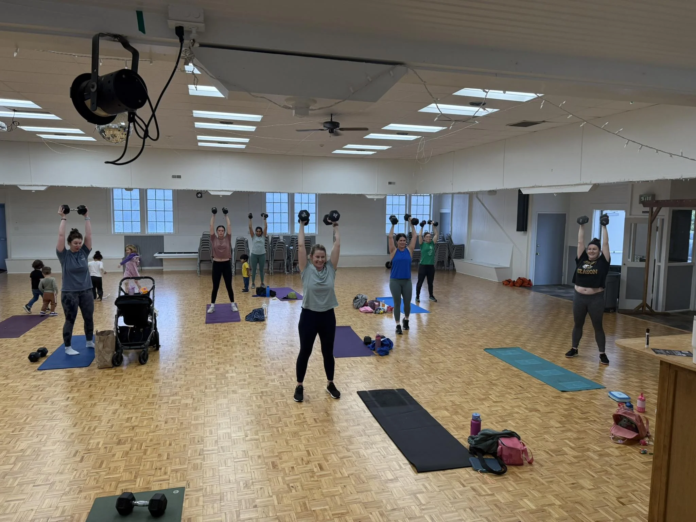
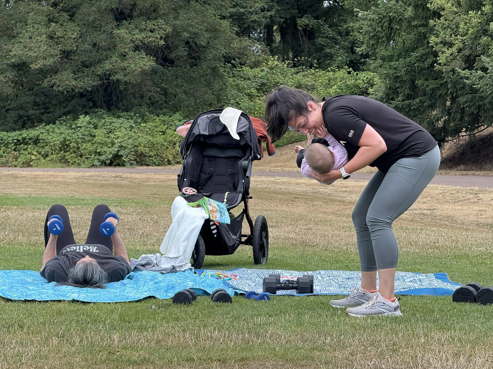

## What to Expect

Classes run 60 minutes and are designed for all fitness levels. You'll get a guided warm-up, 32-40 minutes of strength and conditioning work, and time to cool down and connect at the end. The style is bootcamp and CrossFit-inspired, focused on functional strength, endurance, and efficient conditioning. Options to scale up or down are built into every workout.

Dumbbells are used every class, with resistance bands and other simple equipment occasionally mixed in. Kids are welcome to hang out while you work and many members bring theirs regularly.

The environment is supportive and community-driven. Strong coaching without the pressure or performative gym culture.

---

## What to Bring

Water, a mat if you like one, and whatever your kids might need. Check the [current schedule](/schedule.html) for location and directions.

---

"I had been doing HIIT classes for a long time but felt like my body just couldn't keep up with the high intensity anymore. I was looking for something lower intensity, but everything I tried didn't feel like a real workout. Enter All Seasons Fitness. The strength-focused workouts get my heart rate up, challenge me, and most importantly I leave feeling accomplished every single time."
<cite>Katie Q.</cite>

<a href="https://allseasonsfitness.pushpress.com/landing/plans/plan_d52a452e820d40/login" class="btn section-btn" target="_blank" rel="noopener noreferrer">Book Your Free Class</a>
<a href="/schedule.html" class="btn btn-alt">View Schedule</a>

